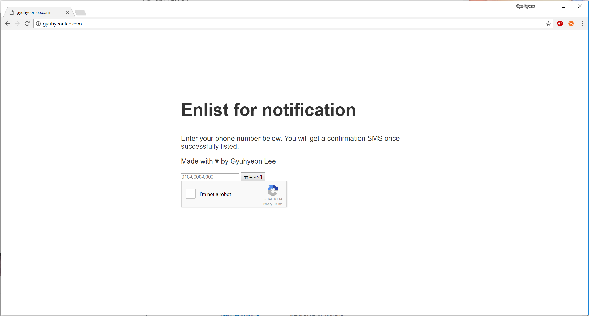

# NaverRecruitNotifier
Crawls a page to check for new positions at Naver Corp.  
Crawls .  
To sign up for the notification, sign up at .  
Note that the link may be down or the website may not provide the same service in the future.  
  
Notification working example :  
  
  
  
Front-end signup example :  
  

  
# Languages/Libraries used
+ Node.js w/ express & request (Server backend)
+ Ejs (frontend rendering)
+ Mysql (Database to store notified job positions & phone numbers to notify)
+ Twilio (SMS service)

# How to use (web service)
Service is provided via . Note that service may end without warning at any time.  

# How to use (fork/code usage)
```
npm install
node app.js
//proper mysql DB config required at one folder higher than root(project folder).
//service will be available at localhost:8000 unless port variable is changed in app.js
```

# License
Copyright (c) 2017 Gyuhyeon Lee

Permission is hereby granted, free of charge, to any person obtaining a copy
of this software and associated documentation files (the "Software"), to deal
in the Software without restriction, including without limitation the rights
to use, copy, modify, merge, publish, distribute, sublicense, and/or sell
copies of the Software, and to permit persons to whom the Software is
furnished to do so, subject to the following conditions:

The above copyright notice and this permission notice shall be included in all
copies or substantial portions of the Software.

THE SOFTWARE IS PROVIDED "AS IS", WITHOUT WARRANTY OF ANY KIND, EXPRESS OR
IMPLIED, INCLUDING BUT NOT LIMITED TO THE WARRANTIES OF MERCHANTABILITY,
FITNESS FOR A PARTICULAR PURPOSE AND NONINFRINGEMENT. IN NO EVENT SHALL THE
AUTHORS OR COPYRIGHT HOLDERS BE LIABLE FOR ANY CLAIM, DAMAGES OR OTHER
LIABILITY, WHETHER IN AN ACTION OF CONTRACT, TORT OR OTHERWISE, ARISING FROM,
OUT OF OR IN CONNECTION WITH THE SOFTWARE OR THE USE OR OTHER DEALINGS IN THE
SOFTWARE.
